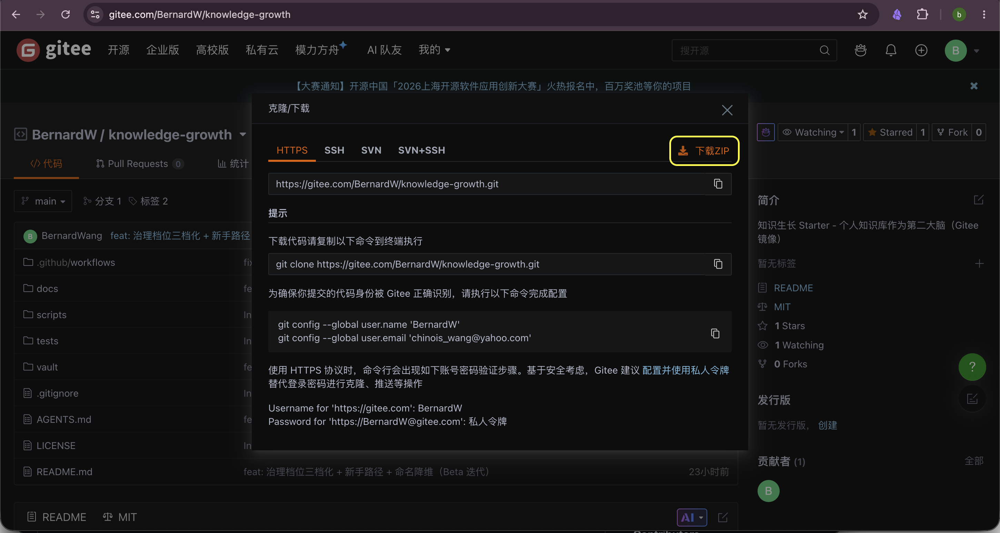
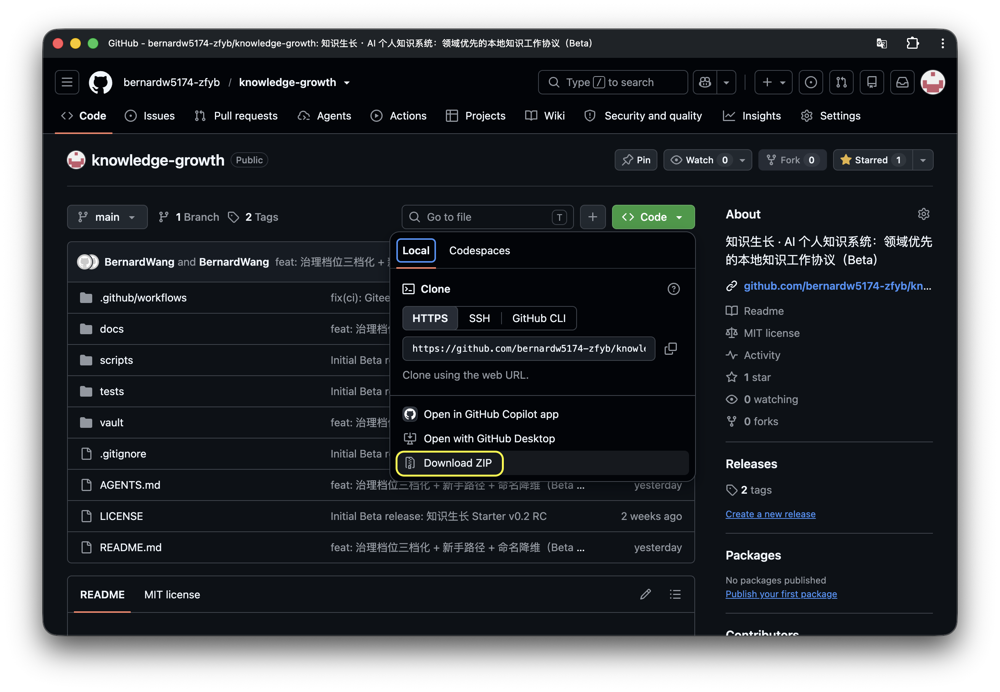
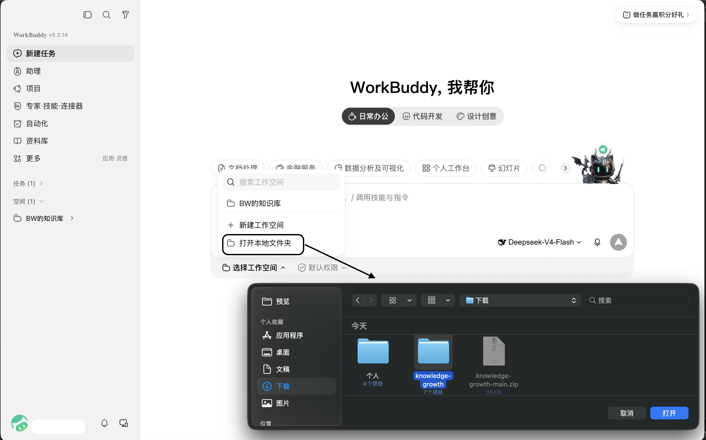
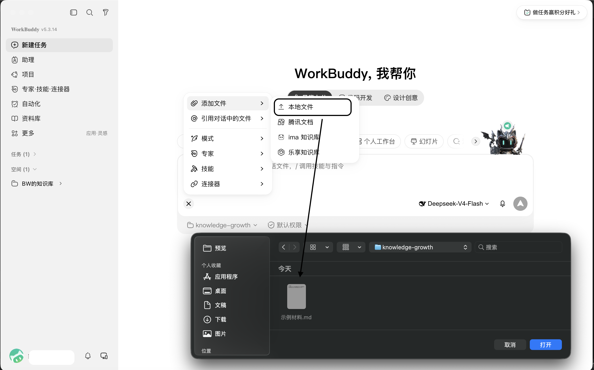
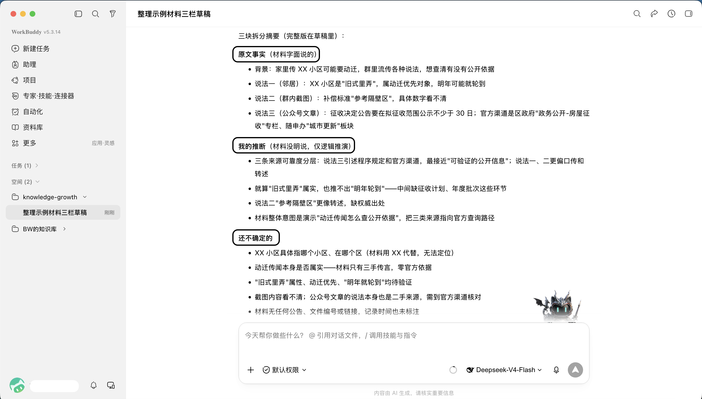

# 知识生长

> **从一个真实问题开始，让材料逐步长成自己的判断。**

一个由 AI 助手协助维护、但始终由你确认判断的本地个人知识工作区。

> **当前完整体验：Windows 电脑 + WorkBuddy 桌面端 + 一份非敏感文件附件。** 手机端 / Android 目前不承诺能完成本地工作区、附件原样保存和知识沉淀的完整链路——这是为了防止你被引导到一半才发现走不通。下面从零开始，一步一步来。

---

## 第一次用，从这里开始

一屏一个动作，每一步做完再走下一步。

### 1. 准备

- 一台 **Windows 电脑**；
- 一份**不敏感**的文件：Word、PDF、Markdown 都可以（不要用身份证、病历、合同、公司机密或他人隐私）。

### 2. 安装 WorkBuddy 桌面端

从官网安装：**https://www.workbuddy.cn/** （请从官方入口下载，不要用第三方下载站）。

### 3. 下载「知识生长」起步包

任选一个能打开的地址，下载 ZIP 并解压：

- **GitHub**：https://github.com/bernardw5174-zfyb/knowledge-growth
- **Gitee**（国内更快）：https://gitee.com/BernardW/knowledge-growth

> 

**GitHub 入口参考**（界面可能略有差异，认「Download ZIP」按钮即可）：

> 

在页面找到下载入口（GitHub 点 `Code → Download ZIP`，Gitee 点「克隆/下载」），下载后解压，得到一个名为 `knowledge-growth` 的文件夹。**不需要懂 Git、仓库或命令行。**

### 4. 把文件夹设为工作区

打开 WorkBuddy，新建一个对话，把刚解压出的 `knowledge-growth` 文件夹设为工作区。

> 

### 5. 上传文件，发第一条指令

用你自己的材料：把第 1 步准备的那份文件，拖进对话框；想偷懒，直接把文件夹里的「示例材料.md」拖进去也行。

拖完后，发下面这句话（整段复制，不用改）：

> 请按这个工作区里的规则，处理我刚上传的这份文件：把内容分成「事实」「你的推断」「还不确定的」三块，先给我一版草稿，不要替我下结论。

AI 可能回问你「归到哪个领域」——填「演示」就行。领域只是给材料贴个标签，这次先跑通，标签以后能改。

> 

### 6. 看见什么算成功

成功标志是两点，而不是一段漂亮的话：

- AI **明确告诉你**：你的原文件已经**原样留了一份副本**（并说清存在哪）；
- AI 给了你一份**待确认的草稿**，把「事实 / 推断 / 不确定」分开，而不是直接替你定了案。

> 

看到这两点，第一次就跑通了。至于目录长什么样、有哪些规则，第一天不用理解。

---

## 第一次跑通，只判断三件事

拿到草稿后，你不用读懂全文，只看三点：

- **事实**：材料里真的这样说了吗？
- **推断**：AI 的关联和解释，你认吗？
- **下一步**：这一步对你的问题有用、且你愿意做吗？

你说「确认」之后，它才会成为正式记录；不确认，就停在草稿，随时能改。

---

## 它解决什么问题

资料越收越多，通常会遇到三个问题：

- 原文、摘要、自己的判断混在一起，回头说不清依据；
- AI 看过材料，却没有留下可审、可改、可复用的过程；
- 还没想清楚，结论和行动已经被自动写死。

知识生长提供的是一套轻量的工作协议：

```text
真实问题 + 一份材料
        ↓
原样留一份原始副本
        ↓
AI 生成可审阅草稿：事实 / 推断 / 不确定项 / 下一步
        ↓
你明确确认后，才成为正式知识
        ↓
需要时，再提炼框架、记录实践或复盘结果
```

**AI 负责整理与提案；你负责确认、取舍与现实决策。**

---

## 核心原则

1. **领域优先**：资料不按「所有原文 / 所有笔记」混放；每个真实领域都有自己的原文、知识、框架、实战和复盘。
2. **来源可追溯**：正式支持的文件附件，会原样保存一份到对应领域，原始材料只进不改。
3. **草稿先行**：AI 可以写草稿，但不能把草稿自动当成你的正式判断。
4. **事实与推断分开**：材料写了什么、AI 推导了什么、仍缺什么信息，应当能被单独审阅。
5. **框架也要确认**：要求「提炼框架」只会生成候选提案；你确认结构后才进入正式框架区。
6. **本地隐私边界**：持久化内容只引用工作区内的相对路径，不应回显附件绝对路径、本机用户名或临时下载位置。

---

## 框架如何产生

当你已经确认了多份知识，并主动说「提炼成框架」时，AI 的第一步必须是创建**框架提案**，而不是直接写进正式框架区。

提案至少应说明：

- 推荐的最小充分结构；
- 每一部分究竟解决什么独立问题；
- 输入 → 处理 → 输出（IPO）；
- 适用范围、证据来源、置信度与缺口；
- 哪些内容只是主框架的一节或附件，不应单独建页。

有限城市经验、单个案例或商业文章不能包装成「全国通用规则」。只有你明确确认采用的结构，才会成为正式框架。

---

## 手工模式

没有可读写本地工作区的 AI 助手时，仍可使用模板，手工维护同一套思路：

- [`vault/_templates/手工模式-问题笔记.md`](vault/_templates/手工模式-问题笔记.md)
- [`vault/_templates/知识草稿.md`](vault/_templates/知识草稿.md)
- [`vault/_templates/阶段总结草稿.md`](vault/_templates/阶段总结草稿.md)

手工模式不自动保存原文、创建领域或生成草稿，但保留同一套「来源 → 草稿 → 确认 → 复盘」的思路。

---

## 进阶：目录结构与技术细节

> 下面是给想理解内部结构、或需要排障的人看的；第一次使用不需要读。

### 工作区结构

```text
vault/
├── 00-系统/                       # schema、manifest、领域索引
├── <已确认领域>/                   # 例如：学习、房产、健康
│   ├── 00-raw/                    # 原始材料的字节级副本，只进不改
│   ├── 01-知识/
│   │   └── _drafts/               # 等待人工确认的草稿
│   ├── 02-框架/                    # 已确认、可跨问题复用的规则
│   ├── 03-实战/                    # 已确认的判断、行动、验证点
│   └── 04-复盘/                    # 结果、修正与经验
└── _templates/                     # 草稿与手工模式模板
```

领域按真实问题逐个创建，不需要一开始就预建「健康 / 理财 / 学习 / 工作」等空目录。

### 治理档位（确认摩擦可调）

`vault/00-系统/manifest.yaml` 里的 `governance_mode` 控制「知识 / 框架」写入时要不要人确认，三档可调：

| 档位 | 知识页 | 框架 | 决策 / 实战 / 复盘 |
|---|---|---|---|
| `free` 自由 | 可自动晋升 | 候选待确认 | 永不自动 |
| `collaborative` 协作（默认） | 草稿待确认，支持批量确认 | 候选待确认 | 永不自动 |
| `strict` 严格 | 草稿待确认，补证后才可晋升 | 候选待确认 | 永不自动 |

**任何档位下不变**：决策、实战、复盘都要你显式指令；框架永远只能先成为候选提案。「不替你下结论」这条底线，跟档位无关。

### 本地脚本与测试

```bash
# 创建一个已确认领域
python3 scripts/create_domain.py "学习"

# 将运行时明确提供的附件路径做字节级复制
python3 scripts/import_attachment.py "/path/from-runtime/article.md" "学习"

# 运行脚本行为测试
python3 -m unittest discover -s tests -v
```

现有测试覆盖：

- 创建领域时生成完整五层目录并更新索引；
- 同名同字节原文不重复保存；
- 同名不同字节原文不覆盖历史材料；
- 路径型非法领域名被拒绝。

> 这些测试验证的是脚本和目录契约，不能替代某个 AI 助手运行时的实际验收。更换助手、模型、操作系统或附件方式时，请先用一份非敏感材料做冒烟测试，并检查所有持久化产物。

### 文件附件与链接的区别

- **文件附件 / 运行时提供的本地文件路径**：本项目的正式支持路径。助手应运行复制脚本，完成字节级复制和校验。
- **URL / 微信文章 / 登录墙网页**：是否能读取取决于运行时与网站限制。本项目**不承诺**任意 URL 都能入库。
- 如果无法取得原始文件字节，助手不得把网页摘要或转写内容冒充为原文副本；可让用户提供 HTML/PDF/文本文件，或将「二手摘录」显式标为非字节级来源。

详细行为边界见 [`AGENTS.md`](AGENTS.md)、[`vault/00-系统/schema.md`](vault/00-系统/schema.md) 与 [兼容性与验证](docs/兼容性与验证.md)。

---

## 隐私与安全

- 文件默认保留在你的电脑；但助手是否把材料发送给模型服务商，取决于你选择的运行时、模型与隐私设置。
- 不要上传敏感个人材料、公司机密或他人隐私。
- 不把工作区内的原文、草稿、正式知识、实践记录和复盘直接提交到公开仓库；本仓库的 `.gitignore` 默认将这些用户数据排除。
- 本项目不提供医疗、法律、投资、职业或关系决策；它只帮助你保存依据、形成可审阅草稿并记录不确定项。

---

## 当前状态与路线

- **当前版本**：v0.1.0（正式版）。
- **已具备**：领域优先目录、原文字节复制脚本、知识草稿/确认流程、框架候选门、治理档位、手工模式模板与脚本行为测试。
- **仍需验证**：每个具体助手 + 模型 + 操作系统组合的附件能力、网页访问能力、持久化隐私边界和完整闭环体验。

如果你使用了新的运行时，欢迎提交可复现的兼容性反馈：运行时/模型/系统版本、输入类型、产生的文件树、协议通过项与卡点。请先删除个人材料和路径信息。

---

## Gitee 镜像（国内访问）

GitHub 在国内访问可能较慢或被墙。本仓库的**完整镜像**同步在 Gitee：

- **GitHub（主仓）**：https://github.com/bernardw5174-zfyb/knowledge-growth
- **Gitee（镜像）**：https://gitee.com/BernardW/knowledge-growth

日常只推 GitHub；通过 GitHub Actions 自动把每次提交镜像到 Gitee（见 `.github/workflows/mirror.yml`）。首次使用前需在本地执行一次初始镜像：

```bash
git remote add gitee https://gitee.com/BernardW/knowledge-growth.git
git push gitee main
```

之后你只需 `git push origin main`，Gitee 会自动跟上。

---

## License

[MIT](LICENSE)

---

**品牌：知识生长 · AI 个人知识系统**
